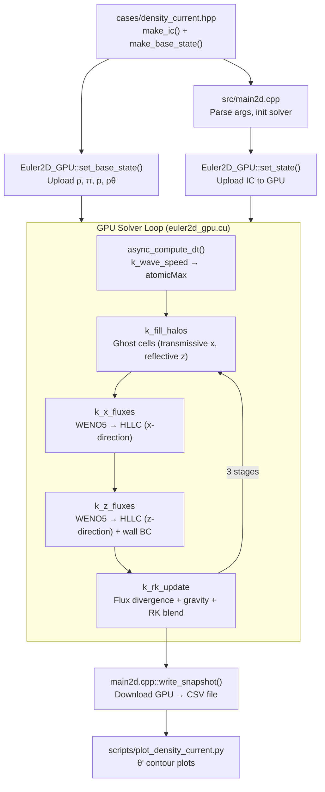

# WFE — Complete Architecture Reference for Developers

> **Last Updated:** 2026-06-08  
> **Version:** 1.0  
> **Purpose:** This document gives the full context needed to understand, modify, and extend the WFE codebase. Read this BEFORE writing any code.

---

## 1. Project Vision & Identity

**WFE** is a ground-up, GPU-first Numerical Weather Prediction (NWP) engine written in **C++20 + CUDA**. It aims to replace the legacy Fortran-based WRF model (~1.5M lines) with a modern, GPU-native alternative.

- **Owner:** Xassemblianist (GitHub)
- **License:** MIT
- **Primary Hardware:** NVIDIA RTX 2060 (sm_75, development), RTX 5070 Ti (sm_120, production target)
- **Ultimate Goal:** Operational 48-hour weather forecast for the Antalya region (Turkey), published as an auto-updating web page

---

## 2. Roadmap & Current Status

| Phase | Scope | Status |
|---|---|---|
| **1** | 1D Shallow Water Equations on GPU | ✅ **DONE** — validated against analytical dam-break |
| **2** | 2D Non-Hydrostatic Compressible Euler | ✅ **DONE** — density current + mountain wave validated |
| **3** | 3D dynamics, basic physics | ✅ **DONE** (basic) — 3D warm bubble test case working |
| **4** | Operational pipeline: GFS/ICON-EU ingest, Zarr output, web viewer | 🔲 Not started |
| **5** | Multi-GPU, ensemble forecasting | 🔲 Not started |

### Phase 2 Sub-Status
- [x] Governing equations implemented (compressible Euler, conservative form)
- [x] WENO5 reconstruction (Jiang-Shu 1996)
- [x] HLLC Riemann solver (upgraded from Rusanov)
- [x] Well-balanced perturbation formulation (ρ', p', θ')
- [x] Hydrostatic base state (analytical π(z) profile)
- [x] SSP-RK3 time integration (Wicker-Skamarock)
- [x] Robert (1993) density current initial conditions
- [x] Reflective z-boundary with anti-symmetric w ghost cells
- [x] Hydrostatic wall pressure extrapolation (p'_wall) — **blowup fix applied**
- [x] CFL-adaptive timestep with async GPU reduction
- [x] Acoustic sub-cycling (Forward-Backward splitting, N_SPLIT=10)
- [x] Rayleigh sponge layer at top boundary
- [x] Smagorinsky turbulence closure (Cs=0.18, Prt=1/3)
- [x] Schär (2002) mountain wave test case + terrain slope flux

### Phase 3 Sub-Status
- [x] 3D grid (SoA [nz+2h][ny+2h][nx+2h])
- [x] 3D HLLC flux kernels (x, y, z directions)
- [x] 3D halo fill (transmissive x, periodic y, well-balanced wall z)
- [x] 3D acoustic sub-cycling (Forward-Backward)
- [x] 3D Smagorinsky diffusion
- [x] 3D Rayleigh sponge
- [x] 3D conservation diagnostics
- [x] Bryan & Fritsch (2002) warm bubble test case
- [ ] Real topography / terrain-following coordinates
- [ ] Moisture / microphysics

---

## 3. Source Tree & File Map

```
WFE/                          (root)
├── CMakeLists.txt                          — CMake config: 4 targets (wfe, wfe2d, wfe_mw, wfe3d)
├── Makefile                                — Linux Makefile (g++ + nvcc), same 4 targets
├── README.md                               — Project overview (Turkish)
├── ARCHITECTURE.md                         — This document
├── HANDOFF.md                              — Phase context for Developer handoff
│
├── src/
│   ├── types.hpp                           — 1D types: Real=double, State{h,hu}, Flux
│   ├── types2d.hpp                         — 2D types: atm constants, EOS, Grid2D, State2D, BaseState
│   ├── types3d.hpp                         — 3D types: Grid3D, BaseState3D
│   ├── main.cpp                            — Phase 1 entry: 1D dam break (CPU/GPU)
│   ├── main2d.cpp                          — Phase 2 entry: 2D density current
│   ├── main_mw.cpp                         — Phase 2 entry: 2D mountain wave
│   ├── main3d.cpp                          — Phase 3 entry: 3D warm bubble
│   │
│   ├── solver/
│   │   ├── swe1d.hpp/cpp                   — CPU 1D SWE: WENO3 + HLLC + SSP-RK3
│   │   └── cuda/
│   │       ├── swe1d_gpu.hpp/cu            — GPU 1D SWE: WENO3 + HLLC + SSP-RK3
│   │       ├── euler2d_gpu.cuh  (128 lines) — GPU 2D Euler solver interface
│   │       ├── euler2d_gpu.cu  (1150 lines) — ⭐ 2D CUDA kernels (WENO5/HLLC/RK3/acoustic/sponge)
│   │       ├── euler3d_gpu.cuh  (103 lines) — GPU 3D Euler solver interface
│   │       └── euler3d_gpu.cu  (1004 lines) — 3D CUDA kernels (same scheme, +y dimension)
│   │
│   └── io/
│       ├── output.hpp/cpp                  — CSV writer (1D)
│
├── cases/
│   ├── dam_break.hpp                       — 1D dam-break IC
│   ├── density_current.hpp                 — Robert (1993) 2D cold bubble IC
│   └── mountain_wave.hpp                   — Schär (2002) mountain wave IC + terrain
│
├── scripts/
│   └── plot_density_current.py             — matplotlib θ' contour plotter
│
├── results/                                — 1D SWE output
├── results_2d/                             — 2D density current output
├── results_mw/                             — 2D mountain wave output
└── results_3d/                             — 3D warm bubble output
```

**Total codebase: ~4,500+ lines** (excluding tests and docs)

---

## 4. Build System

Two build paths exist, both produce the same 4 binaries: `wfe`, `wfe2d`, `wfe_mw`, `wfe3d`.

### CMake (Cross-Platform — Windows + Linux)
```bash
cmake -B build
cmake --build build --config Release
```

### Makefile (Linux only)
```bash
make all          # builds build/wfe, build/wfe2d, build/wfe_mw, build/wfe3d
make clean        # removes build/
```

### Compiler Flags
- **C++:** C++20 standard, platform-optimized (`-O3 -march=native` on GCC, `/O2` on MSVC)
- **CUDA:** `-std=c++17 -O3 --use_fast_math --expt-relaxed-constexpr --expt-extended-lambda`
- **GPU Architectures:** sm_75 (Turing), sm_86 (Ampere), sm_89 (Ada)

### Run Examples
```bash
./build/Release/wfe2d --nx 256 --nz 64 --tend 900 --cfl 0.4     # density current
./build/Release/wfe_mw --nx 500 --nz 105 --tend 10000            # mountain wave
./build/Release/wfe3d --nx 100 --ny 100 --nz 50 --tend 600       # 3D warm bubble
```

---

## 5. Mathematical Formulation

### 5.1 Governing Equations
2D compressible non-hydrostatic Euler equations in conservative form:

$$\frac{\partial}{\partial t} \begin{pmatrix} \rho \\ \rho u \\ \rho w \\ \rho\theta \end{pmatrix} + \frac{\partial}{\partial x} \begin{pmatrix} \rho u \\ \rho u^2 + p \\ \rho u w \\ \rho\theta u \end{pmatrix} + \frac{\partial}{\partial z} \begin{pmatrix} \rho w \\ \rho w u \\ \rho w^2 + p \\ \rho\theta w \end{pmatrix} = \begin{pmatrix} 0 \\ 0 \\ -\rho g \\ 0 \end{pmatrix}$$

### 5.2 Equation of State
Exner pressure closes the system:
- `π = (Rd · ρθ / p₀)^(Rd/cv)` 
- `p = p₀ · π^(cp/Rd)`
- Constants: Rd=287, cp=1004, cv=717, γ=cp/cv, p₀=100000 Pa, g=9.81

### 5.3 Well-Balanced Decomposition
The solver splits all variables into base state + perturbation:
- **Base state:** hydrostatic atmosphere with θ̄=300K, analytically computed ρ̄(z) and π̄(z)
- **Perturbation:** ρ' = ρ - ρ̄, p' = p - p̄, etc.
- **Why:** Avoids catastrophic cancellation when computing ∂p/∂z ≈ -ρg (both sides are ~10⁵)
- **Flux formulation:** Only p' appears in momentum flux → zero net force at equilibrium
- **Gravity source:** Only -ρ'g in the w-equation → zero when ρ=ρ̄

### 5.4 WENO5 Reconstruction (Jiang-Shu 1996)
- 5th-order weighted essentially non-oscillatory scheme
- Uses 5-point stencil (cells i-2 to i+2) → requires **3 ghost cells** per side
- Applied to **perturbation variables** (ρ', ρu, ρw, ρθ') separately
- Left-biased (`weno5L`) and right-biased (`weno5R`) variants provide L/R states at interfaces
- Smoothness indicators: JS96 formula (standard)
- Optimal weights: {1/10, 3/5, 3/10} (left), {3/10, 3/5, 1/10} (right)

### 5.5 HLLC Riemann Solver
- Separate implementations for x-direction (`hllc_x`) and z-direction (`hllc_z`)
- Wave speed estimates: Davis bounds (u±a)
- Contact wave (S*) resolves pressure-velocity coupling
- Base-state pressure subtracted: flux uses (p - p_b) in momentum equation

### 5.6 Time Integration: SSP-RK3 (Wicker-Skamarock)
Shu-Osher form:
```
q₁ = q  + dt · L(q)
q₂ = ¾q + ¼(q₁ + dt · L(q₁))
q  = ⅓q + ⅔(q₂ + dt · L(q₂))
```
Each stage: fill halos → compute x-fluxes → compute z-fluxes → RK update

---

## 6. CUDA Architecture

### 6.1 Memory Layout
- **Structure of Arrays (SoA):** Each variable (ρ, ρu, ρw, ρθ) is a separate flat array
- **2D layout:** `[nz+2h][nx+2h]` where h=3 (WENO5 halo)
- **Indexing:** `(iz + halo) * stride + (ix + halo)` — x is the fast dimension (coalesced)
- **Stride:** `nx + 2*halo`

### 6.2 Device Memory Allocations
| Buffer | Count | Size | Purpose |
|---|---|---|---|
| State arrays (q^n) | 4 | grid.size() each | ρ, ρu, ρw, ρθ for current timestep |
| Stage 1 arrays | 4 | grid.size() each | RK3 intermediate stage 1 |
| Stage 2 arrays | 4 | grid.size() each | RK3 intermediate stage 2 |
| X-flux arrays | 4 | (nx+1)×nz each | Face-normal fluxes at x-interfaces |
| Z-flux arrays | 4 | grid.size() each | Face-normal fluxes at z-interfaces |
| Base state | 4 | nz+2h each | ρ̄, π̄, p̄, ρθ̄ (1D profiles, z-dependent) |
| smax (reduction) | 1 | 1 scalar | Max wave speed for CFL |
| **Total** | **~25 arrays** | | For nx=256, nz=64: ~25 × 262×70 × 8B ≈ **3.6 MB** |

### 6.3 Kernel Map (2D)
| Kernel | Grid | Block | Purpose |
|---|---|---|---|
| `k_fill_halos` | ceil(halo/64) | 64 | Ghost cell BCs (transmissive x, reflective z) |
| `k_x_fluxes` | ceil((nx+1)/32) × ceil(nz/8) | 32×8 | WENO5→HLLC in x-direction |
| `k_z_fluxes` | ceil(nx/32) × ceil((nz+1)/8) | 32×8 | WENO5→HLLC in z + hydrostatic wall BC + terrain |
| `k_slow_tendencies` | ceil(nx/32) × ceil(nz/8) | 32×8 | -(∂Fx/∂x + ∂Fz/∂z) flux divergence |
| `k_acoustic_step_momentum` | ceil(nx/32) × ceil(nz/8) | 32×8 | Forward: ρu,ρw += dtt*(T_slow - ∇p' + buoy) |
| `k_acoustic_step_mass` | ceil(nx/32) × ceil(nz/8) | 32×8 | Backward: ρ,ρθ updated from new momentum |
| `k_rk_combine` | ceil(nx/32) × ceil(nz/8) | 32×8 | RK3 stage blending: c_old*q_old + c_stg*q_stg |
| `k_diffusion` | ceil(nx/32) × ceil(nz/8) | 32×8 | Smagorinsky or fixed-K Laplacian diffusion |
| `k_rayleigh_damping` | ceil(nx/32) × ceil(nz/8) | 32×8 | Sponge: -(α·sin²)·(q - q̄) at top boundary |
| `k_wave_speed` | ceil(nx/32) × ceil(nz/8) | 32×8, shared | Max(|u|+a, |w|+a) reduction → atomicMax |
| `k_diagnostics` | ceil(nx/32) × ceil(nz/8) | 32×8, shared | Conservation: mass, KE, PE, ρθ reduction |

### 6.4 Step Pipeline (Split-Explicit SSP-RK3)
```
step() {
  // CFL timestep (async, non-blocking)
  collect_dt();            // harvest previous async result
  async_compute_dt(ρ, ρθ); // kick off new wave speed reduction
  dtt = dt / N_SPLIT;      // acoustic sub-step size

  for stage in [1, 2, 3]:
    launch_slow_tendencies(q)  // fill halos → x-fluxes → z-fluxes → divergence + diffusion
    copy q → q_sub
    for m in [0, N_SPLIT):
      launch_acoustic_step(q_sub, q_ref, dtt)  // Forward momentum, Backward mass
    launch_rk_combine(...)     // RK3 blending: c_old*q_old + c_stg*q_sub
    launch_rayleigh_damping()  // sponge at top boundary

  t += dt
}
```

### 6.5 Boundary Conditions
| Direction | Type | Implementation |
|---|---|---|
| X (left/right) | Transmissive (zero-gradient) | Ghost = interior value (per-perturbation) |
| Z (bottom/top) | Rigid wall (reflective for w) | ρ': hydrostatic extrapolation, w: anti-symmetric, ρu/ρθ: zero-gradient |
| Z wall faces | Hydrostatic pressure wall | p'_wall = p'_cell ± ½Δz·ρ'·g (prevents acoustic blowup) |

---

## 7. Test Cases

### 7.1 Robert (1993) Density Current (Active)
- **Domain:** x ∈ [-12.8, 12.8] km, z ∈ [0, 6.4] km
- **Grid:** 256×64 cells → dx=dz=100m
- **Base state:** θ̄=300K, hydrostatic ρ̄(z) with π̄(z) = 1 - gz/(cp·θ̄)
- **Perturbation:** Cold bubble θ' = -15K · cos²(πR/2) for R≤1
  - Center: (0, 3000)m, half-widths: (4000, 2000)m
- **Duration:** 900s (15 minutes)
- **Expected behavior:** Cold air sinks, spreads along ground, Kelvin-Helmholtz billows form

### 7.2 Schär (2002) Mountain Wave (Implemented)
- **Domain:** x ∈ [-25, 25] km, z ∈ [0, 21] km
- **Grid:** 500×105 cells → dx=100m, dz=200m
- **Base state:** Constant-N atmosphere (N=0.01/s), isothermal T̄=250K
- **Terrain:** Bell-shaped mountain h(x) = h0·exp(-(x/a)²)·cos²(πx/λ), h0=250m
- **Inflow:** ū = 10 m/s uniform horizontal wind
- **Sponge:** Rayleigh damping above 15 km (τ=100s)
- **Duration:** 10000s (steady-state orographic wave pattern)
- **Binary:** `wfe_mw`

### 7.3 Bryan & Fritsch (2002) 3D Warm Bubble (Implemented)
- **Domain:** 20 km × 20 km × 10 km
- **Grid:** 100×100×50 cells → Δx=Δy=Δz=200m
- **Base state:** Isentropic θ̄=300K, hydrostatic
- **Perturbation:** θ'=+2K spherical Gaussian at (xc, yc, 2km)
- **Duration:** 600s
- **Binary:** `wfe3d`

### 7.4 Dam Break (Phase 1, Done)
- 1D shallow water, validated against exact Riemann solution

---

## 8. Known Issues & Future Improvements

### ✅ RESOLVED: Vertical Velocity Blowup
- **Was:** w grew exponentially due to well-balanced boundary error
- **Fix:** Hydrostatic wall pressure extrapolation in `k_z_fluxes` — WENO5/HLLC is completely bypassed at f=0 and f=nz, replaced by direct p'_wall = p'_cell ± ½Δz·ρ'·g
- **Status:** Fixed and working

### ✅ RESOLVED: Acoustic Sub-Cycling
- **Was:** N_SPLIT defined but unused
- **Fix:** Full Forward-Backward acoustic integration implemented with N_SPLIT=10 sub-steps per RK3 stage
- **Status:** Working in both 2D and 3D solvers

### ✅ RESOLVED: Sponge Layer
- **Was:** No damping at top boundary
- **Fix:** Rayleigh damping kernel `k_rayleigh_damping` — sin²-profile alpha from z_bot to z_top
- **Status:** Working in both 2D and 3D

### 🟢 Future: I/O Performance
- CSV output via `fprintf` — adequate for current grid sizes
- Need binary (NetCDF/Zarr) for Phase 4 operational pipeline

### 🟢 Future: Wave Speed Reduction
- Uses `atomicMax` on int-reinterpreted float — works but suboptimal
- For large 3D grids, a two-pass shuffle reduction would be faster

### 🟢 Future: MSVC Compiler Warnings
- MSVC ignores `-O3` and `-march=native` flags (GCC-only) with D9002 warnings
- LNK4098 LIBCMT conflict warning during linking — cosmetic, does not affect execution

---

## 9. Data Flow Diagram



---

## 10. Key Conventions & Patterns

### Code Style
- **Real = double** everywhere (no float path yet)
- CUDA error checking via `CK(call)` macro — throws `std::runtime_error`
- Device functions marked `__device__ __forceinline__`
- Kernel names prefixed with `k_` (e.g., `k_x_fluxes`)
- Host wrappers prefixed with `launch_` (e.g., `launch_x_fluxes`)

### Array Indexing
```cpp
// Interior cell (ix, iz) → flat index:
int gi = (iz + halo) * stride + (ix + halo);

// X-flux at interface f between cells (f-1) and f:
int fidx = iz * (nx + 1) + f;     // f = 0..nx

// Z-flux at interface f between cells (f-1) and f:
int fidx = f * stride + (ix + halo);  // f = 0..nz
```

### Perturbation Variables
```cpp
// In flux kernels, always subtract base state before WENO:
r[k+2] = rho[iz_k * stride + ix_] - rho_b[iz_k];
// Then add it back after reconstruction:
rL = rL_perturbation + rho_b[iz_];
```

---

## 11. Action Plan (Prioritized)

### ✅ Completed (v1.0)

| # | Task | Status |
|---|---|---|
| 1 | Fix wall boundary in k_z_fluxes | ✅ Done — hydrostatic extrapolation bypasses WENO at walls |
| 2 | Acoustic sub-cycling | ✅ Done — Forward-Backward, N_SPLIT=10 |
| 3 | Rayleigh sponge layer | ✅ Done — sin²-profile damping |
| 4 | Smagorinsky turbulence | ✅ Done — Cs=0.18, Prt=1/3 |
| 5 | Schär mountain wave IC + terrain | ✅ Done |
| 6 | 3D solver + warm bubble | ✅ Done |
| 7 | Cross-platform build (Windows MSVC + Linux GCC) | ✅ Done |

### 🟡 Next (Phase 4 — Operational Pipeline)

| # | Task | Details |
|---|---|---|
| 8 | GFS/ICON-EU GRIB2 reader | Real initial & boundary conditions |
| 9 | NetCDF/Zarr output | Replace CSV for production-scale I/O |
| 10 | Web viewer | Streaming forecast visualization on GitHub Pages |
| 11 | Thompson microphysics | 8-class cloud/precip CUDA kernel |
| 12 | YSU PBL | Planetary boundary layer parameterization |

### 🟢 Long-Term (Phase 5)

| # | Task | Details |
|---|---|---|
| 13 | Multi-GPU domain decomposition | NCCL-based halo exchange |
| 14 | Ensemble forecasting | 16-member convection-permitting ensemble |
| 15 | ML-augmented forecasting | Learned subgrid closures, FourCastNet-style emulator |

---

## 12. References

| Paper | Used For |
|---|---|
| Robert (1993) | Density current test case benchmark |
| Straka et al. (1993) | Density current reference solution |
| Schär et al. (2002) | Mountain wave test case (planned) |
| Jiang & Shu (1996) | WENO5 reconstruction algorithm |
| Wicker & Skamarock (2002) | SSP-RK3 time integration |
| Klemp, Skamarock & Dudhia (2007) | Split-explicit acoustic time stepping |
| Skamarock & Klemp (2008) | WRF model architecture reference |
| Gal-Chen & Somerville (1975) | Terrain-following coordinates (planned) |
| Toro (2009) | HLLC Riemann solver theory |

---

## 13. Quick Start for a New Developer

```markdown
1. Read THIS document first
2. Key solver files:
   - 2D: src/solver/cuda/euler2d_gpu.cu (~1150 lines)
   - 3D: src/solver/cuda/euler3d_gpu.cu (~1000 lines)
3. Build (Windows): cmake -B build && cmake --build build --config Release
4. Build (Linux):   make clean all
5. Run:   ./build/Release/wfe2d --tend 900 --cfl 0.4
6. Plot:  cd scripts && python3 plot_density_current.py
```

> [!IMPORTANT]
> **Do NOT change the mathematical formulation** (EOS, base state, WENO weights) without understanding why it's there. The well-balanced structure is intentional and fragile — a single sign error in the perturbation decomposition will cause catastrophic numerical blowup.
