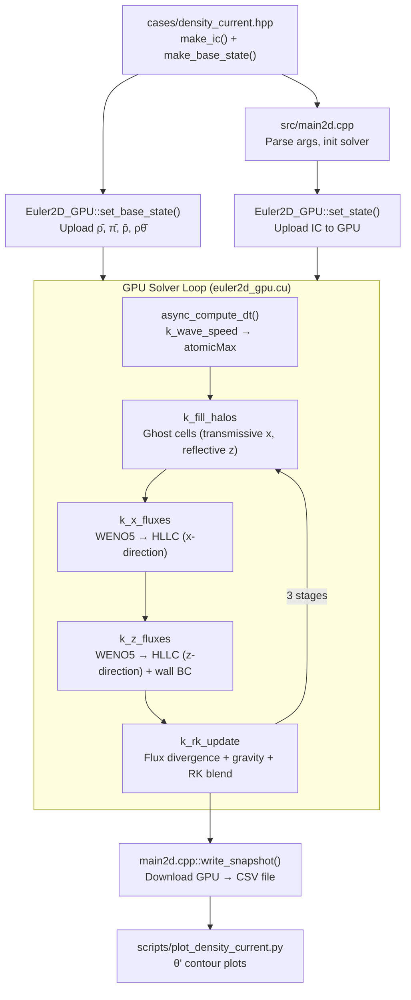

# WFE — Complete Architecture Reference for AI Agents

> **Last Updated:** 2026-05-04  
> **Purpose:** This document gives any AI model (Claude, Gemini, GPT, etc.) the full context needed to understand, modify, and extend the WFE codebase. Read this BEFORE writing any code.

---

## 1. Project Vision & Identity

**WFE** is a ground-up, GPU-first Numerical Weather Prediction (NWP) engine written in **C++20 + CUDA**. It aims to replace the legacy Fortran-based WRF model (~1.5M lines) with a modern, GPU-native alternative.

- **Owner:** Xassemblianist (GitHub)
- **License:** MIT
- **Primary Hardware:** NVIDIA RTX 2060 (sm_75, development), RTX 5070 Ti (sm_120, production target)
- **Ultimate Goal:** Operational 48-hour weather forecast for the Antalya region (Turkey), published as an auto-updating web page

---

## 2. Roadmap & Current Status

| Phase | Scope | Status |
|---|---|---|
| **1** | 1D Shallow Water Equations on GPU | ✅ **DONE** — validated against analytical dam-break |
| **2** | 2D Non-Hydrostatic Compressible Euler | 🔴 **IN PROGRESS** — solver runs but has numerical stability issues |
| **3** | 3D dynamics, terrain-following coords, basic physics | 🔲 Not started |
| **4** | Operational pipeline: GFS/ICON-EU ingest, Zarr output, web viewer | 🔲 Not started |
| **5** | Multi-GPU, ensemble forecasting | 🔲 Not started |

### Phase 2 Sub-Status
- [x] Governing equations implemented (compressible Euler, conservative form)
- [x] WENO5 reconstruction (Jiang-Shu 1996)
- [x] HLLC Riemann solver (upgraded from Rusanov)
- [x] Well-balanced perturbation formulation (ρ', p', θ')
- [x] Hydrostatic base state (analytical π(z) profile)
- [x] SSP-RK3 time integration (Wicker-Skamarock)
- [x] Robert (1993) density current initial conditions
- [x] Reflective z-boundary with anti-symmetric w ghost cells
- [x] Hydrostatic wall pressure extrapolation (p'_wall)
- [x] CFL-adaptive timestep with async GPU reduction
- [ ] **BLOCKER:** Vertical velocity blowup (exponential w growth)
- [ ] Acoustic sub-cycling (Forward-Backward splitting)
- [ ] Rayleigh sponge layer at top boundary
- [ ] Schär (2002) mountain wave test case
- [ ] Terrain-following coordinates (Gal-Chen & Somerville)

---

## 3. Source Tree & File Map

```
WFE/                          (root)
├── CMakeLists.txt               (53 lines)  — cmake config, C++20 + CUDA 17, sm_75/86/89
├── Makefile                     (58 lines)  — standalone make, builds `wfe` (1D) + `wfe2d` (2D)
├── README.md                                — project vision (Turkish)
├── HANDOFF.md                               — Phase 2 context for AI agent handoff
├── TECHNICAL_ANALYSIS_FOR_GEMINI_PRO.md     — detailed numerical analysis
├── MULTI_AGENT_WORKFLOW.md                  — multi-AI delegation protocol
│
├── src/
│   ├── types.hpp                (49 lines)  — 1D types: Real=double, State{h,hu}, Flux, physical_flux()
│   ├── types2d.hpp              (77 lines)  — 2D types: atm constants, EOS, Grid2D, State2D, BaseState
│   ├── main.cpp                (113 lines)  — Phase 1 entry: 1D dam break (CPU/GPU selectable)
│   ├── main2d.cpp              (135 lines)  — Phase 2 entry: 2D density current (GPU only), CSV output
│   │
│   ├── solver/
│   │   ├── swe1d.hpp            (41 lines)  — CPU 1D SWE solver interface
│   │   ├── swe1d.cpp           (219 lines)  — CPU 1D SWE: WENO3 + HLLC + SSP-RK3
│   │   └── cuda/
│   │       ├── swe1d_gpu.hpp    (67 lines)  — GPU 1D SWE solver interface
│   │       ├── swe1d_gpu.cu    (336 lines)  — GPU 1D SWE: WENO3 + HLLC + SSP-RK3
│   │       ├── euler2d_gpu.cuh (100 lines)  — GPU 2D Euler solver interface (the active solver)
│   │       └── euler2d_gpu.cu  (782 lines)  — ⭐ THE MAIN FILE — all 2D CUDA kernels
│   │
│   └── io/
│       ├── output.hpp           (27 lines)  — CSV writer interface (1D)
│       └── output.cpp           (46 lines)  — CSV snapshot writer (1D)
│
├── cases/
│   ├── dam_break.hpp            (35 lines)  — 1D dam-break IC parameters
│   └── density_current.hpp     (110 lines)  — Robert (1993) 2D cold bubble IC + hydrostatic base state
│
├── scripts/
│   └── plot_density_current.py  (47 lines)  — matplotlib θ' contour plotter
│
├── results_2d/                              — CSV simulation snapshots (22 files from previous runs)
└── results/                                 — 1D SWE results
```

**Total codebase: ~2,285 lines** (excluding tests and docs)

---

## 4. Build System

Two build paths exist, both produce the same binaries:

### Makefile (Primary)
```bash
make all          # builds build/wfe (1D) + build/wfe2d (2D)
make clean        # removes build/
```

### CMake (1D only, currently)
```bash
mkdir build && cd build && cmake .. && make
```

> [!WARNING]
> The CMakeLists.txt only builds the 1D `wfe` binary. The Makefile builds both 1D and 2D. **Use the Makefile** for Phase 2 work.

### Compiler Flags
- **C++:** `-std=c++20 -O3 -march=native`
- **CUDA:** `-std=c++17 -O3 --use_fast_math --expt-relaxed-constexpr --expt-extended-lambda`
- **GPU Architectures:** sm_75 (Turing), sm_86 (Ampere), sm_89 (Ada)
- **Note:** sm_120 (Blackwell) is commented out, requires CUDA 12.8+

### Run
```bash
./build/wfe2d --nx 256 --nz 64 --tend 900 --cfl 0.4
```

---

## 5. Mathematical Formulation

### 5.1 Governing Equations
2D compressible non-hydrostatic Euler equations in conservative form:

$$\frac{\partial}{\partial t} \begin{pmatrix} \rho \\ \rho u \\ \rho w \\ \rho\theta \end{pmatrix} + \frac{\partial}{\partial x} \begin{pmatrix} \rho u \\ \rho u^2 + p \\ \rho u w \\ \rho\theta u \end{pmatrix} + \frac{\partial}{\partial z} \begin{pmatrix} \rho w \\ \rho w u \\ \rho w^2 + p \\ \rho\theta w \end{pmatrix} = \begin{pmatrix} 0 \\ 0 \\ -\rho g \\ 0 \end{pmatrix}$$

### 5.2 Equation of State
Exner pressure closes the system:
- `π = (Rd · ρθ / p₀)^(Rd/cv)` 
- `p = p₀ · π^(cp/Rd)`
- Constants: Rd=287, cp=1004, cv=717, γ=cp/cv, p₀=100000 Pa, g=9.81

### 5.3 Well-Balanced Decomposition
The solver splits all variables into base state + perturbation:
- **Base state:** hydrostatic atmosphere with θ̄=300K, analytically computed ρ̄(z) and π̄(z)
- **Perturbation:** ρ' = ρ - ρ̄, p' = p - p̄, etc.
- **Why:** Avoids catastrophic cancellation when computing ∂p/∂z ≈ -ρg (both sides are ~10⁵)
- **Flux formulation:** Only p' appears in momentum flux → zero net force at equilibrium
- **Gravity source:** Only -ρ'g in the w-equation → zero when ρ=ρ̄

### 5.4 WENO5 Reconstruction (Jiang-Shu 1996)
- 5th-order weighted essentially non-oscillatory scheme
- Uses 5-point stencil (cells i-2 to i+2) → requires **3 ghost cells** per side
- Applied to **perturbation variables** (ρ', ρu, ρw, ρθ') separately
- Left-biased (`weno5L`) and right-biased (`weno5R`) variants provide L/R states at interfaces
- Smoothness indicators: JS96 formula (standard)
- Optimal weights: {1/10, 3/5, 3/10} (left), {3/10, 3/5, 1/10} (right)

### 5.5 HLLC Riemann Solver
- Separate implementations for x-direction (`hllc_x`) and z-direction (`hllc_z`)
- Wave speed estimates: Davis bounds (u±a)
- Contact wave (S*) resolves pressure-velocity coupling
- Base-state pressure subtracted: flux uses (p - p_b) in momentum equation

### 5.6 Time Integration: SSP-RK3 (Wicker-Skamarock)
Shu-Osher form:
```
q₁ = q  + dt · L(q)
q₂ = ¾q + ¼(q₁ + dt · L(q₁))
q  = ⅓q + ⅔(q₂ + dt · L(q₂))
```
Each stage: fill halos → compute x-fluxes → compute z-fluxes → RK update

---

## 6. CUDA Architecture

### 6.1 Memory Layout
- **Structure of Arrays (SoA):** Each variable (ρ, ρu, ρw, ρθ) is a separate flat array
- **2D layout:** `[nz+2h][nx+2h]` where h=3 (WENO5 halo)
- **Indexing:** `(iz + halo) * stride + (ix + halo)` — x is the fast dimension (coalesced)
- **Stride:** `nx + 2*halo`

### 6.2 Device Memory Allocations
| Buffer | Count | Size | Purpose |
|---|---|---|---|
| State arrays (q^n) | 4 | grid.size() each | ρ, ρu, ρw, ρθ for current timestep |
| Stage 1 arrays | 4 | grid.size() each | RK3 intermediate stage 1 |
| Stage 2 arrays | 4 | grid.size() each | RK3 intermediate stage 2 |
| X-flux arrays | 4 | (nx+1)×nz each | Face-normal fluxes at x-interfaces |
| Z-flux arrays | 4 | grid.size() each | Face-normal fluxes at z-interfaces |
| Base state | 4 | nz+2h each | ρ̄, π̄, p̄, ρθ̄ (1D profiles, z-dependent) |
| smax (reduction) | 1 | 1 scalar | Max wave speed for CFL |
| **Total** | **~25 arrays** | | For nx=256, nz=64: ~25 × 262×70 × 8B ≈ **3.6 MB** |

### 6.3 Kernel Map
| Kernel | Grid | Block | Purpose |
|---|---|---|---|
| `k_fill_halos` | ceil(halo/64) | 64 | Ghost cell BCs (transmissive x, reflective z) |
| `k_x_fluxes` | ceil((nx+1)/32) × ceil(nz/8) | 32×8 | WENO5→HLLC in x-direction |
| `k_z_fluxes` | ceil(nx/32) × ceil((nz+1)/8) | 32×8 | WENO5→HLLC in z-direction + wall BC |
| `k_rk_update` | ceil(nx/32) × ceil(nz/8) | 32×8 | Flux divergence + gravity source + RK blend |
| `k_wave_speed` | ceil(nx/32) × ceil(nz/8) | 32×8, shared | Max(|u|+a, |w|+a) reduction → atomicMax |

### 6.4 Step Pipeline (per RK3 step)
```
step() {
  // CFL timestep (async, non-blocking)
  collect_dt();            // harvest previous async result
  async_compute_dt(ρ, ρθ); // kick off new wave speed reduction

  for stage in [1, 2, 3]:
    launch_x_fluxes(q_stage)   // WENO5 → HLLC in x
    launch_z_fluxes(q_stage)   // WENO5 → HLLC in z + wall BC
    launch_rk_update(...)      // -(∂F/∂x + ∂G/∂z) - ρ'g + RK blend
    launch_fill_halos(q_next)  // ghost cells for next stage

  t += dt
}
```

### 6.5 Boundary Conditions
| Direction | Type | Implementation |
|---|---|---|
| X (left/right) | Transmissive (zero-gradient) | Ghost = interior value (per-perturbation) |
| Z (bottom/top) | Rigid wall (reflective for w) | ρ': hydrostatic extrapolation, w: anti-symmetric, ρu/ρθ: zero-gradient |
| Z wall faces | Hydrostatic pressure wall | p'_wall = p'_cell ± ½Δz·ρ'·g (prevents acoustic blowup) |

---

## 7. Test Cases

### 7.1 Robert (1993) Density Current (Active)
- **Domain:** x ∈ [-12.8, 12.8] km, z ∈ [0, 6.4] km
- **Grid:** 256×64 cells → dx=dz=100m
- **Base state:** θ̄=300K, hydrostatic ρ̄(z) with π̄(z) = 1 - gz/(cp·θ̄)
- **Perturbation:** Cold bubble θ' = -15K · cos²(πR/2) for R≤1
  - Center: (0, 3000)m, half-widths: (4000, 2000)m
- **Duration:** 900s (15 minutes)
- **Expected behavior:** Cold air sinks, spreads along ground, Kelvin-Helmholtz billows form

### 7.2 Schär (2002) Mountain Wave (Planned)
- Not yet implemented
- Requires terrain-following coordinates and mountain profile h(x)

### 7.3 Dam Break (Phase 1, Done)
- 1D shallow water, validated against exact Riemann solution

---

## 8. Known Issues & Active Bugs

### 🔴 CRITICAL: Vertical Velocity Blowup
- **Symptom:** w grows exponentially (14 m/s in 3 seconds), even with zero perturbation
- **Root cause:** Well-balanced boundary error at rigid walls
  - Ghost cell zero-gradient BC causes WENO5 to see flat pressure at boundaries
  - This makes ∂p'/∂z = 0 at walls, leaving -ρ'g completely unbalanced
  - Factor-of-2 discrete imbalance pumps energy into acoustic modes
- **Partial fix applied:** Hydrostatic wall pressure extrapolation in `k_z_fluxes` (lines 443–457)
  - p'_wall = p'_cell ± ½Δz·ρ'·g
- **Status:** Fix is in code but stability verification incomplete — may need further refinement

### 🟡 Missing: Acoustic Sub-Cycling
- The atmosphere is stiff: sound waves ~340 m/s vs advection ~20 m/s
- Without splitting, the global dt is forced extremely small to satisfy acoustic CFL
- `N_SPLIT = 6` is defined but **never used** in `step()`
- Needs Forward-Backward acoustic integration within each RK3 stage

### 🟡 Missing: Sponge Layer
- No Rayleigh damping at the top boundary
- Gravity waves reflect off the rigid lid, contaminating the solution over long runs

### 🟢 Minor: I/O Performance
- CSV output via `fprintf` — adequate for 256×64 but will bottleneck at production scale
- Need binary (NetCDF/Zarr) for Phase 3+

### 🟢 Minor: `base_.theta_b` Naming Confusion
- `base_.theta_b` actually stores **ρθ̄** (rhoTheta_base), not θ̄
- See `set_base_state()` line 637: `rT_b[iz] = p_b[iz] / (Rd * pi_b[iz])`
- Name should be `base_.rhoTh_b` or documented clearly

### 🟢 Minor: Wave Speed Reduction
- Uses `atomicMax` on `double_as_longlong` — works but creates a serialization bottleneck
- For large grids, a two-pass shuffle reduction would be faster

---

## 9. Data Flow Diagram



---

## 10. Key Conventions & Patterns

### Code Style
- **Real = double** everywhere (no float path yet)
- CUDA error checking via `CK(call)` macro — throws `std::runtime_error`
- Device functions marked `__device__ __forceinline__`
- Kernel names prefixed with `k_` (e.g., `k_x_fluxes`)
- Host wrappers prefixed with `launch_` (e.g., `launch_x_fluxes`)

### Array Indexing
```cpp
// Interior cell (ix, iz) → flat index:
int gi = (iz + halo) * stride + (ix + halo);

// X-flux at interface f between cells (f-1) and f:
int fidx = iz * (nx + 1) + f;     // f = 0..nx

// Z-flux at interface f between cells (f-1) and f:
int fidx = f * stride + (ix + halo);  // f = 0..nz
```

### Perturbation Variables
```cpp
// In flux kernels, always subtract base state before WENO:
r[k+2] = rho[iz_k * stride + ix_] - rho_b[iz_k];
// Then add it back after reconstruction:
rL = rL_perturbation + rho_b[iz_];
```

---

## 11. Action Plan (Prioritized)

### 🔴 Immediate (Fix the Blocker)

| # | Task | File | Details |
|---|---|---|---|
| 1 | **Fix wall boundary in k_z_fluxes** | euler2d_gpu.cu:443-457 | Current implementation computes HLLC flux first then overrides — should bypass WENO/HLLC entirely at f=0 and f=nz. Use direct hydrostatic extrapolation only. |
| 2 | **Verify hydrostatic equilibrium** | main2d.cpp | Run with `dtheta_cold = 0.0` — velocities must remain exactly 0.00 at all times |
| 3 | **Validate density current** | density_current.hpp | Run with `dtheta_cold = -15.0`, 900s. Check for KH billows in θ' contour |

### 🟡 Near-Term (Phase 2 Completion)

| # | Task | Details |
|---|---|---|
| 4 | **Acoustic sub-cycling** | Implement Forward-Backward splitting loop inside each RK3 stage. Split pressure gradient + gravity into N_SPLIT sub-steps. This is the #1 performance unlock. |
| 5 | **Rayleigh sponge layer** | Add damping term in top ~1km: `-α(z) · (q - q̄)` where α increases toward top |
| 6 | **Schär mountain wave IC** | Create `cases/mountain_wave.hpp`, requires constant-N base state + sinusoidal terrain |
| 7 | **Terrain-following coords** | Gal-Chen & Somerville (1975) — add metric terms to flux divergences |
| 8 | **Shared memory WENO** | Load 5-point stencil into shared memory once per block in x-flux kernel |

### 🟢 Long-Term (Phase 3+)

| # | Task | Details |
|---|---|---|
| 9 | Extend to 3D | Add y-dimension, 3D flux kernels, 3D grid |
| 10 | Thompson microphysics | 8-class cloud/precip scheme as independent CUDA kernel |
| 11 | YSU PBL | Planetary boundary layer parameterization |
| 12 | GFS/ICON-EU GRIB2 reader | Real initial & boundary conditions |
| 13 | Zarr output + web viewer | Replace CSV, deploy to GitHub Pages |
| 14 | Multi-GPU domain decomposition | NCCL-based halo exchange |

---

## 12. References

| Paper | Used For |
|---|---|
| Robert (1993) | Density current test case benchmark |
| Straka et al. (1993) | Density current reference solution |
| Schär et al. (2002) | Mountain wave test case (planned) |
| Jiang & Shu (1996) | WENO5 reconstruction algorithm |
| Wicker & Skamarock (2002) | SSP-RK3 time integration |
| Klemp, Skamarock & Dudhia (2007) | Split-explicit acoustic time stepping |
| Skamarock & Klemp (2008) | WRF model architecture reference |
| Gal-Chen & Somerville (1975) | Terrain-following coordinates (planned) |
| Toro (2009) | HLLC Riemann solver theory |

---

## 13. Quick Start for a New AI Agent

```markdown
1. Read THIS document first
2. The active file is: src/solver/cuda/euler2d_gpu.cu (782 lines)
3. Build: `make -C /home/ostriquetrum/WFE clean all`
4. Run:   `./build/wfe2d --tend 3 --cfl 0.4`
5. Check: `max_u` and `max_w` in stdout — they should NOT grow exponentially
6. If stable, run full: `./build/wfe2d --tend 900 --cfl 0.4`
7. Plot:  `cd scripts && python3 plot_density_current.py`
```

> [!IMPORTANT]
> **Do NOT change the mathematical formulation** (EOS, base state, WENO weights) without understanding why it's there. The well-balanced structure is intentional and fragile — a single sign error in the perturbation decomposition will cause catastrophic numerical blowup.
